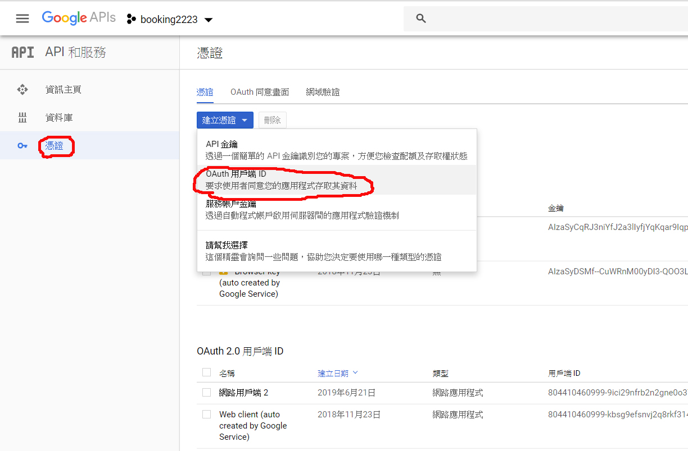
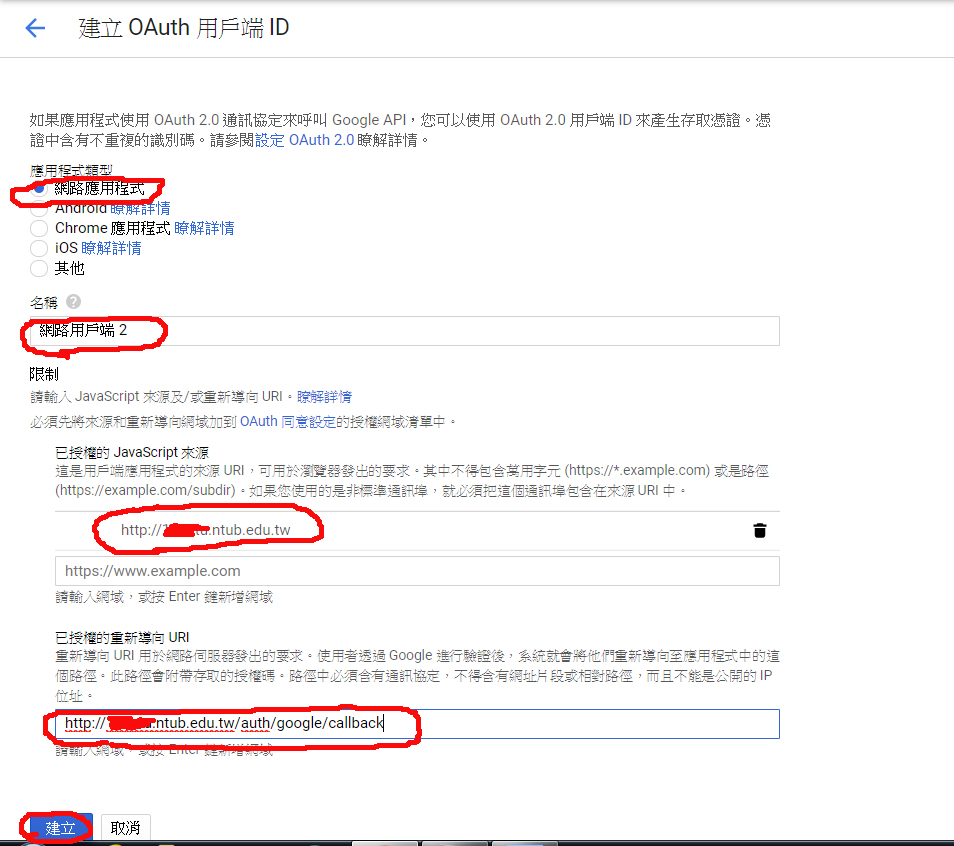
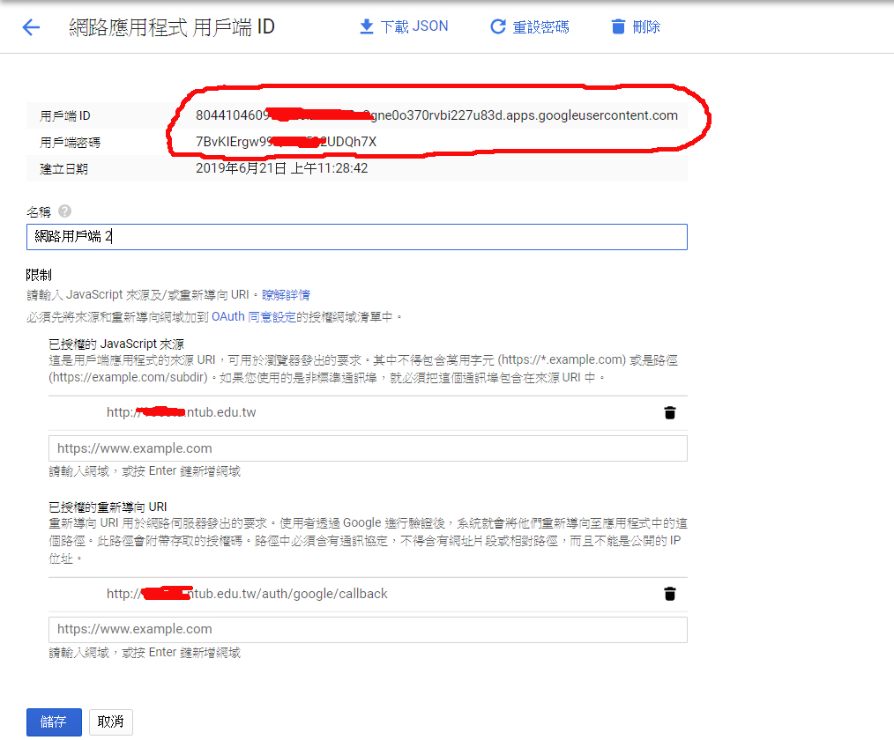
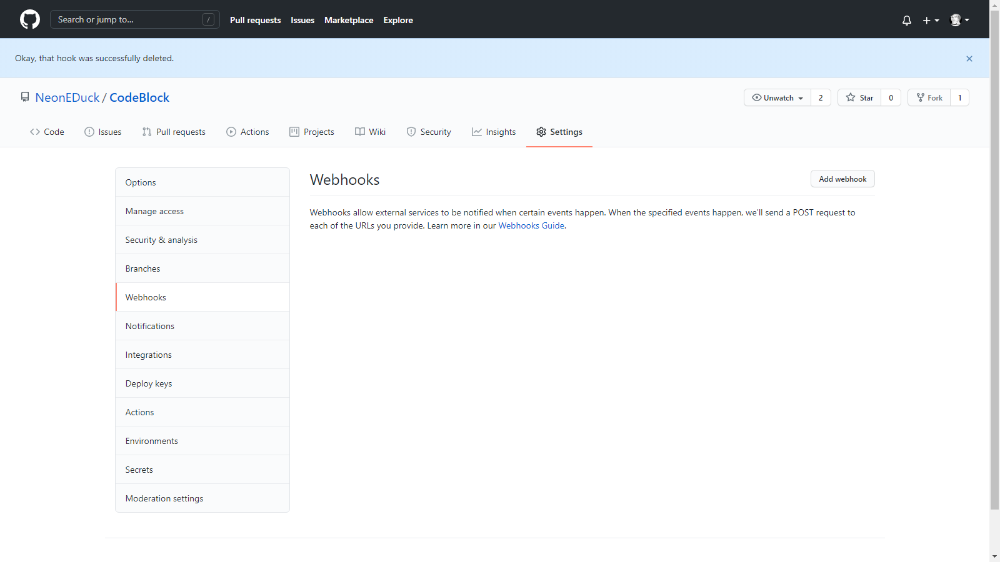
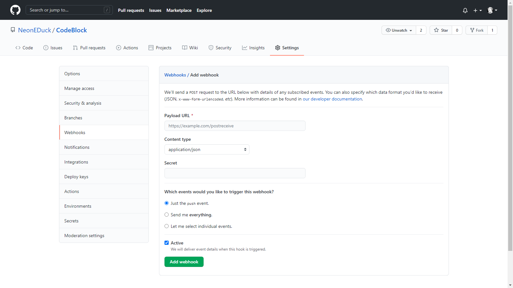

# 安裝教學

## 安裝需求
[Node.js](https://nodejs.org/)  
[Git](https://git-scm.com/downloads)  
[Postgre 資料庫](https://www.postgresql.org/download/) *(可以另找雲端資料庫)*

## 前言
此專案大多數的檔案都是Unity相關檔案, 所有網頁相關的檔案全部都會在Web資料夾裡，所以下面的動作全部將會在Web資料夾裡進行。

## 設定環境變數
打開CodeBlock Environment Editor.exe已進行設定  


### **Postgre資料庫**
將資料庫的設定填入

### **Google OAuth**
CodeBlock使用Google OAuth作為登入選項，因此必須要有DNS才能順利開啟

使用Google OAuth2登入
```
因為都已經將所需要之套件打包好了
因此只須雙擊CodeBlock/Web/start.bat
便可以自動安裝
```

#### (1) 登入Google cloud platform, https://console.developers.google.com/
```
註: 以下選擇「建立OAuth用戶端ID」後, 會再被要求選擇「應用程式類型」, 此時選擇「網頁應用程式」.
```
 

#### (2) 建立OAuth用戶端ID
```
註: (1) 以下「已授櫂的JavaScript來源」可以不填;

    (2) 以下「已授櫂的重新導向URI」, 如果網站將上傳至Heroku, 可以寫成:
        https://[Heroku上的應用程式名稱].herokuapp.com/auth/google/callback
```

 

#### (3) 得到用戶端ID及用戶端密碼 


#### (4) 將用戶端ID及用戶端密碼填入app.js 
```
//載入google oauth2
var GoogleStrategy = require('passport-google-oauth20').Strategy;

//填入自己在google cloud platform建立的憑證
passport.use(
    new GoogleStrategy({
        clientID: '請填入自己的用戶端ID', 
        clientSecret: '請填入自己的用戶端密碼',
        callbackURL: "請填入自己的callbackURL, 如:https://[Heroku上的應用程式名稱].herokuapp.com/auth/google/callback, 作為認證後的呼叫方法"
    },
    function(accessToken, refreshToken, profile, done) {
        if (profile) {
            return done(null, profile);
        }else {
            return done(null, false);
        }
    }
));
```

### **Git Secret**
想要開啟[Github > CodeBlock自動更新](#GHCB)的話，必須要設Git Secret

## 設定Postgre資料庫


## Github > CodeBlock自動更新<a name="GHCB"></a>
### 如果要開啟Github > CodeBlock自動更新，需要：
- 將CodeBlock專案上傳或Clone到自己Github帳號的Repository裡。
- 打開自己CodeBlock專案的Setting -> Webhook
- 點擊Add webhooks

  

- 把"http://```www.你的DNS.com```/github?pass=```Git Secret```"輸入到Payload URL ***(Git Secret在環境變數裡做設定)***

  

- Content type選擇application/json
- 點擊Add webhook
