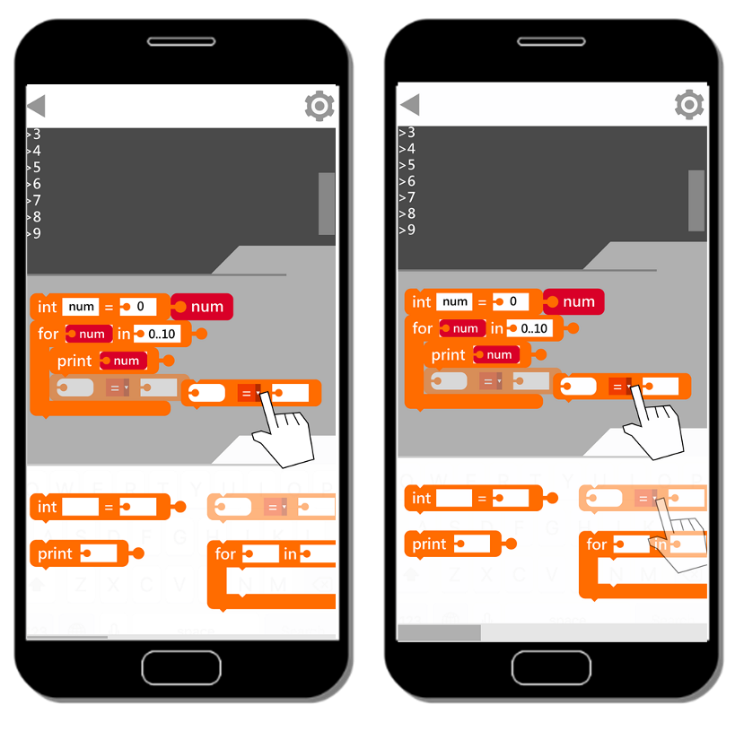

# 系統簡介
組　　別：    | 第108xxx組
------------ | -------------
專題名稱：    | CodeBlock 程式遊戲的運算思維
指導教師：    | 張隆君
專題學生：    | 10556008王皓澤 10556017詹項淮 10556028廖育群 10556044高登

database      |                |             |            |              |              |        |
------------- | -------------- | ----------- | ---------- | ------------ | ------------ | ------ |
player :      | player_id      | player_name | email      | password     | perfer_color |        |
crouse :      | crouse_id      | coruse_name | type_id    | hint         | player_id    | block… |
play_record : | player_id      | coruse_id   | score_time | score_amount | score_blocks | string |
crouse_type : | type_id        | type_name   |            |              |              |        |

### 一、前言
---
在108年的十二年國教新課綱，國小階段的初階程式設計課程，並沒有被規劃在固定的學習時數；所以，重視升學考試科目的學生以及家長，開始求助學校體制外的補習班業者，進行學習兒童程式設計課程。比較令人遺憾的是，對於偏鄉地區的弱勢學生來說，由於沒有足夠的資源與師資，也沒有教授程式設計課程的補習班；所以，想學好程式設計課程，就變成遙不可及的夢想。為了解決社會資源的不足，並提供更多選擇和公平學習的機會，本組將進行開發一款免費的數位遊戲，應用在國小階段的初階程式設計課程，進行學習程式設計的相關知識。

因此，本組將進行規畫運用Unity開發一款CodeBlock積木遊戲，將遊戲和程式設計的知識內容進行結合，讓學生透過玩遊戲學程式的方式，引起學生對於程式設計的興趣，並提升學生的學習動機、邏輯思維、問題解決、以及創新思考能力，幫助學生能夠輕鬆了解如何運用運算思維來解決遊戲情境中的問題，未來也能夠順利銜接進階程式設計課程。

### 二、系統功能簡介
---
 本組依據資訊科技課程的教學內容，開發一款結合智慧型手機的CodeBlock積木遊戲來教導從未學習過程式設計課程的學生。同時幫助學生了解程式設計的基本概念與認識，因此，採用Unity進行模組設計和創建2D遊戲系統環境，以呈現動態的學習畫面。另外，再透過遊戲的**問題知識提示和獎勵機制**，來幫助學生減少學習的挫折感，並避免理解錯誤，適合剛入門的新手學生進行學習。系統之架構如圖1所示。

本系統架構主要包括**問題知識提示和獎勵機制**、學習模組、測驗模組、學習記錄模組，其功能分述如下：

1.	問題知識提示和獎勵機制：
在問題知識提示和獎勵機制部分，透過每個關卡的**知識提示**來引導學生反思在遊戲情境中的基本知識與概念的理解。另外，獎勵是構成娛樂遊戲的關鍵部分，並以完成每個關卡的學習任務給予獎勵並作為鼓勵。

2.	學習模組：內含各單元程式設計學習教材，由本組成員參考107臺北市科技領域國小資訊科技課程教學綱要，共同進行規劃與設計，為學生使用本系統學習課程內容的主要來源。其中包含**五個主要學習**關卡之教材。

3.	測驗練習模組：包含測試題庫與詳解內容兩部份，於接續學習模組後使用。每個關卡之試題根據所搭配教材進行出題。

4.	學習記錄模組：記錄學生使用CodeBlock積木遊戲時，所表現的**問題知識提示和積分獎勵**數據，如：學習時間、教材單元、成績等。學生於登入遊戲系統後，開始觀看學習教材知識內容，再進行題組練習，系統便開進行錄學生的學習行為。

### 三、系統使用對象
---
本組使用對象為沒有學習過程式設計課程的國小五、六年級學生。

### 四、系統特色
---
本組開發的CodeBlock積木遊戲是結合問題知識提示和獎勵機制的學習系統。學生透過智慧型手機登入個人系統介面，系統說明遊戲規則介紹以及操作說明。另外，學生可以調整自己的學習時間和學習狀態，並可自由選擇不同級別的遊戲進行學習，如圖2所示。

透過CodeBlock積木遊戲中的**知識提示和積分獎勵**的功能，能夠讓學生在測驗練習的過程中得到正確知識的反饋，讓學生在學習過程中能夠完成各階段的學習任務，並從中獲得積分獎勵，更能激發學生積極參與學習，並提高程式設計的相關知識。

     

### 五、系統開發工具
---
由於Codeblock積木遊戲，是需要以2D進行遊戲開發，因此，選擇Unity作為跨平台APP的技術開發。而且，Unity 較為專業和穩定，而且處理效率高，還可以將一次的編碼，再作多個平台使用(例如：Web、PC、Mac、Android、iOS)，提供人性化的操作介面，和網路多人連線的功能，以及縮短開發的時間與減少成本；也就是說，即使運用不同的行動載具，也能輕鬆的開啟CodeBlock積木遊戲進行學習。

另外，Unity 在遊戲市場上也有提供Unity Asset Store資源商店。所有製作遊戲的元件，如美術設定、3D模型、動畫檔、視覺化腳本系統(例如：PlayMaker和Behave)以及先進的著色器、貼圖、粒子特效。Unity介面是完全腳本化的，允許很多協力廠商外掛程式通過適當的整合加入到Unity GUI中，也是多數開發者會使用資源商店中的套件。

### 六、系統使用環境
---
目前現有的行動載具，所使用的作業平台，包括Web、PC、Mac、Android、iOS 等，由於在初期規劃 APP 時，考量到預算和製作時間的問題，因此，決定以 Android作為優先開發的作業平台。因為Android Studio是一個為 Android平台開發程式的整合式開發環境，主要為 Java整合式開發環境，特別為Android開發者所特殊客製而成，並允許於 Windows、OSX和Linux平台上均可執行。
### 七、結論及未來發展
---
目前十二年國民教育的程式設計課程已正式納入國、高中的資訊科技課程，然而目前尚未有針對國小程式設計課程之相關配套措施，導致國小學生未來在進入國中階段的程式設計課程時，造成學生的學習門檻過高。此外，目前國小可參考程式設計課程的學習教材也相對的缺乏；因此，本組期望能提供國小學生運用CodeBlock積木遊戲，促進對程式設計方面的學習動機、邏輯思維、問題解決、以及創新思考能力；未來可進一步透過實驗的方式來測量學生的學習表現。